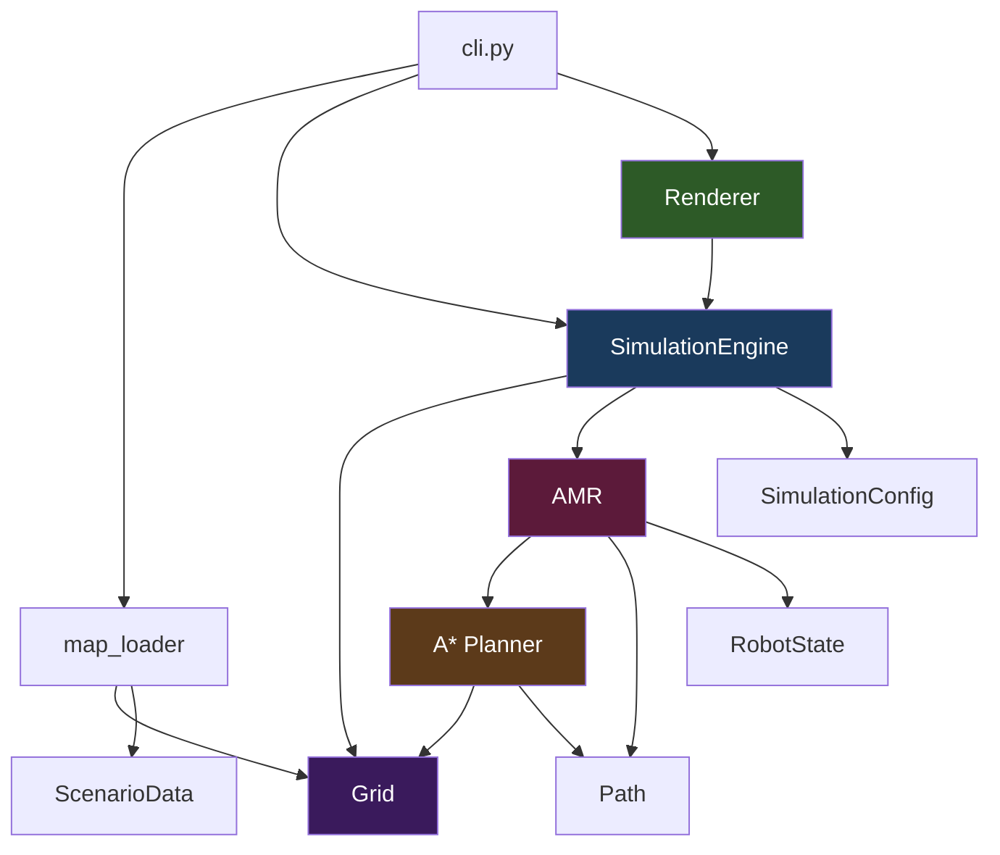
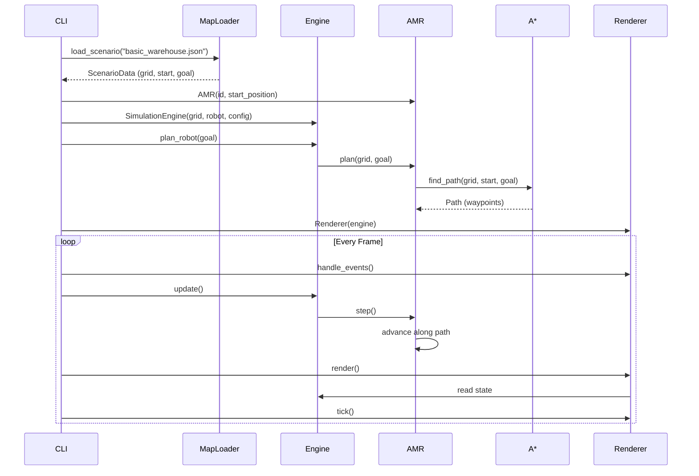
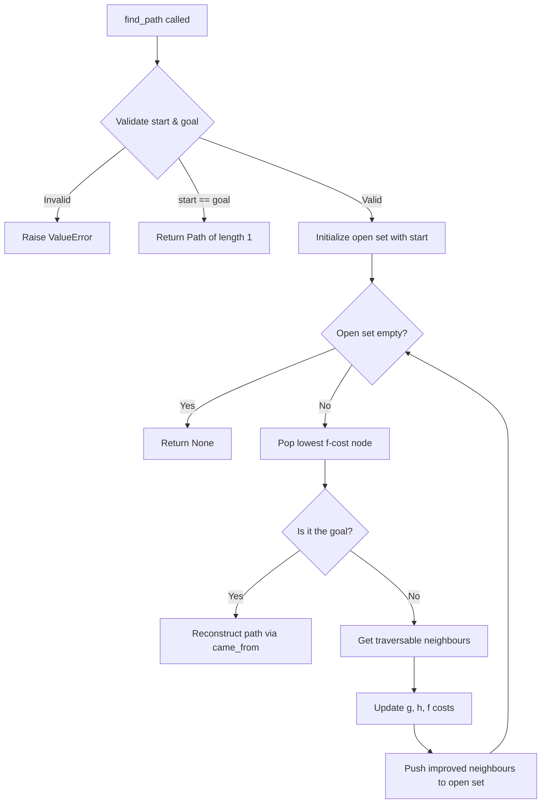

# SwarmOS — Architecture

## Overview

SwarmOS is structured around a strict separation of concerns that enables:
- **Headless simulation** for automated benchmarking
- **Independent robot agents** for decentralised multi-robot coordination
- **Modular planners** that can be swapped or extended
- **Clean testing** without GUI dependencies

---

## Module Responsibilities



### `warehouse/` — Environment Model

| Module | Responsibility |
|--------|---------------|
| `cell.py` | `Position` (immutable coordinate) and `CellType` (extensible enum) |
| `grid.py` | 2D grid: bounds checking, traversability, neighbour queries |
| `map_loader.py` | Parses scenario JSON → `Grid` + robot start/goal |

**Design rule**: The warehouse answers environmental questions ("Is this cell traversable?"). It never decides *where* a robot should go.

### `planning/` — Pathfinding

| Module | Responsibility |
|--------|---------------|
| `astar.py` | A* search with Manhattan heuristic. Input: Grid + start + goal. Output: Path or None. |
| `path.py` | Ordered waypoint sequence with cursor-based traversal |

**Design rule**: The planner depends only on the Grid interface. It has no knowledge of robots, rendering, or simulation time.

### `robot/` — Agent Model

| Module | Responsibility |
|--------|---------------|
| `amr.py` | AMR class: owns its position, state, path. Uses the planner. |
| `state.py` | `RobotState` enum (IDLE → MOVING → ARRIVED) |

**Design rule**: Each AMR is an independent agent. It *uses* a planner but doesn't *contain* planning logic. This prepares for the future decentralised architecture where each robot has its own local world model and decision loop.

### `simulation/` — Engine

| Module | Responsibility |
|--------|---------------|
| `engine.py` | Discrete-tick simulation loop. Manages grid + robots + time. |
| `config.py` | Immutable configuration (cell size, tick rate, step delay) |

**Design rule**: The engine is headless-capable. It never imports Pygame. This is critical for running thousands of benchmark simulations without a display.

### `visualization/` — Rendering

| Module | Responsibility |
|--------|---------------|
| `renderer.py` | Pygame renderer. Reads engine state, draws it. Never mutates simulation state. |

**Design rule**: The renderer is a pure *observer*. It can be removed entirely without affecting simulation correctness.

---

## Data Flow



---

## Simulation Loop

```
INITIALIZE CLI + parse args
         │
         ▼
    LOAD SCENARIO (JSON → Grid + start/goal)
         │
         ▼
    CREATE AMR (id, start position)
         │
         ▼
    CREATE ENGINE (grid, robot, config)
         │
         ▼
    PLAN PATH (AMR calls A* → Path)
         │
         ▼
  ┌─── RUN LOOP ◄──────────────────┐
  │      │                          │
  │      ▼                          │
  │  HANDLE EVENTS (quit?)          │
  │      │                          │
  │      ▼                          │
  │  UPDATE ENGINE (tick + step)    │
  │      │                          │
  │      ▼                          │
  │  RENDER (draw state)            │
  │      │                          │
  │      ▼                          │
  │  GOAL REACHED? ─── No ─────────┘
  │      │
  │     Yes
  │      │
  └──── END
```

---

## A* Planning Flow



---

## Future Extension Points

The Phase 1 architecture is designed so these additions are natural, not refactors:

| Future Feature | Extension Point |
|---------------|----------------|
| Multiple robots | Engine holds `list[AMR]`; update loop iterates all |
| New cell types | Add variants to `CellType` enum |
| Re-planning | AMR calls `plan()` again with updated grid state |
| Local world model | AMR stores its own `Grid` copy, updated via sensors |
| Peer communication | Add `CommunicationChannel` injected into each AMR |
| Conflict resolution | AMR checks reservations before `step()` |
| Battery/velocity | Add fields to AMR (slots already extensible) |
| New planners | Create `planning/dijkstra.py`, same interface |
| Benchmarking | Use `--headless` mode, run many scenarios |
| Dashboard | Read-only observer, same as Renderer pattern |

### Future Robot Architecture (Decentralised)

```
Robot N
├── local state (position, battery, task)
├── local planner (A* or better)
├── local world model (own copy of grid + peer positions)
├── peer communication (P2P messaging)
└── local decision making (conflict resolution, task negotiation)
```

No central `FleetController`. The simulation engine orchestrates *time* (ticks), not *decisions*.

---

## Testing Strategy

- Tests depend only on domain modules (`warehouse`, `planning`, `robot`)
- Tests never import Pygame
- Tests verify **behaviour**, not implementation details
- All pathfinding edge cases are covered: unreachable goals, invalid positions, obstacles, trivial paths
