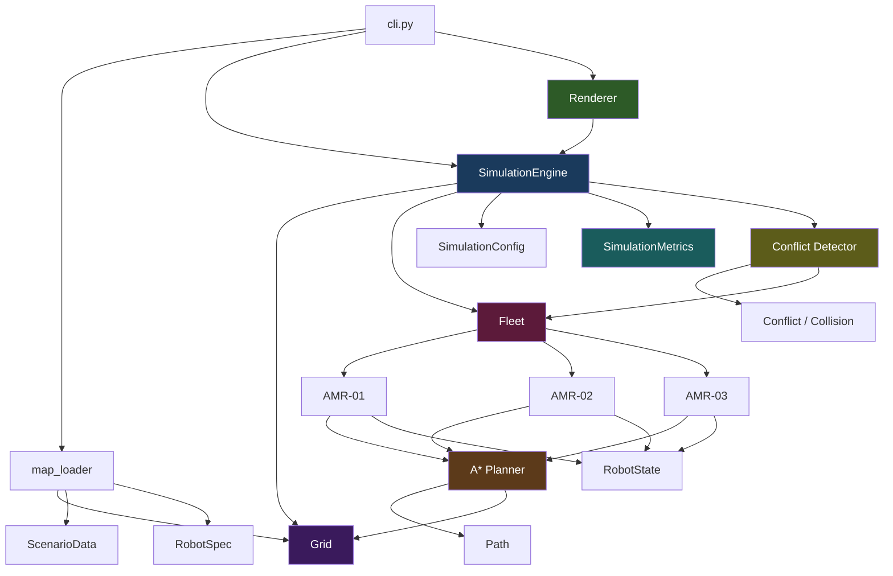
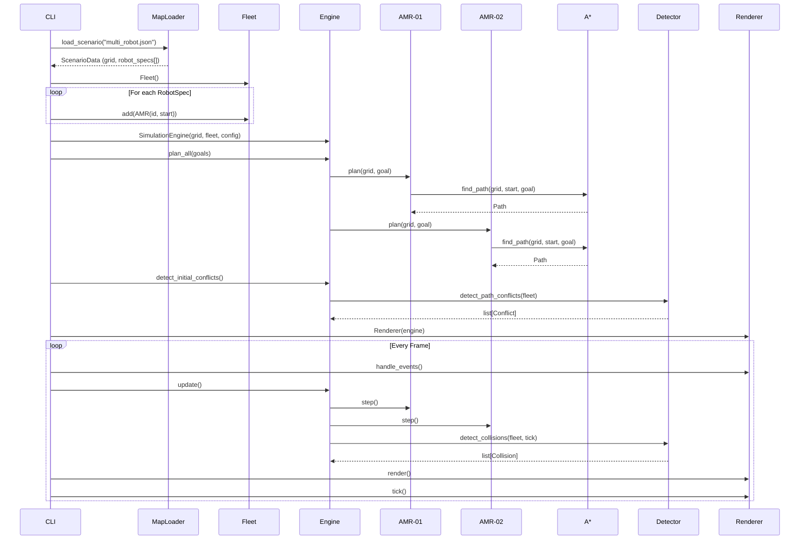
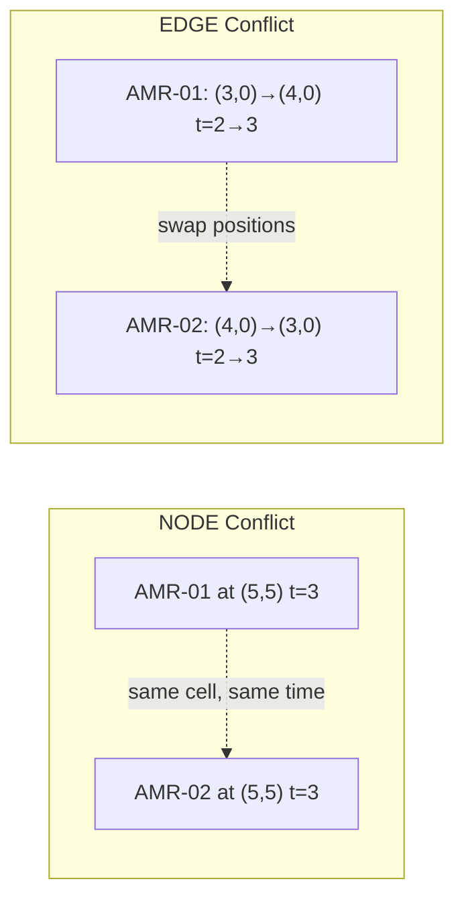
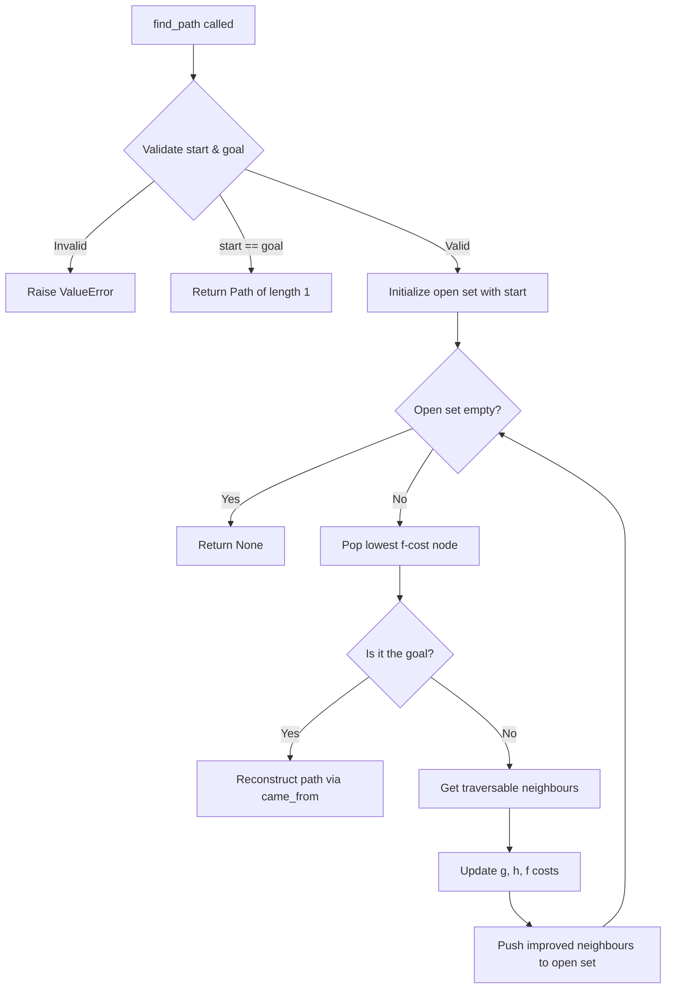

# SwarmOS — Architecture

## Overview

SwarmOS is structured around a strict separation of concerns that enables:
- **Headless simulation** for automated benchmarking
- **Independent robot agents** for decentralised multi-robot coordination
- **Modular planners** that can be swapped or extended
- **Clean testing** without GUI dependencies
- **Conflict detection** separate from conflict resolution

---

## Module Responsibilities



### `warehouse/` — Environment Model

| Module | Responsibility |
|--------|---------------|
| `cell.py` | `Position` (immutable coordinate) and `CellType` (extensible enum) |
| `grid.py` | 2D grid: bounds checking, traversability, neighbour queries |
| `map_loader.py` | Parses scenario JSON → `Grid` + list of `RobotSpec` (supports both Phase 1 and Phase 2 formats) |

**Design rule**: The warehouse answers environmental questions ("Is this cell traversable?"). It never decides *where* a robot should go.

### `planning/` — Pathfinding

| Module | Responsibility |
|--------|---------------|
| `astar.py` | A* search with Manhattan heuristic. Input: Grid + start + goal. Output: Path or None. |
| `path.py` | Ordered waypoint sequence with cursor-based traversal |

**Design rule**: The planner depends only on the Grid interface. It has no knowledge of robots, rendering, or simulation time.

### `robot/` — Agent Model

| Module | Responsibility |
|--------|---------------|
| `amr.py` | AMR class: owns its position, state, path. Uses the planner. |
| `state.py` | `RobotState` enum (IDLE → MOVING → ARRIVED) |
| `fleet.py` | Fleet: ordered collection of AMRs with unique IDs. State container, not a controller. |

**Design rule**: Each AMR is an independent agent. The Fleet holds them but doesn't direct them. This prepares for the decentralised architecture where each robot owns its own decision-making.

### `coordination/` — Conflict Detection *(Phase 2)*

| Module | Responsibility |
|--------|---------------|
| `conflict.py` | Data models: `Conflict` (path overlap), `Collision` (runtime overlap), `ConflictType` enum |
| `detector.py` | Static path conflict detection (node + edge) and runtime collision detection |

**Design rule**: Detection ≠ Resolution. This module *reports* problems. Future phases will add resolution protocols in separate modules.

### `simulation/` — Engine

| Module | Responsibility |
|--------|---------------|
| `engine.py` | Discrete-tick simulation loop. Manages grid + fleet + time + metrics. |
| `config.py` | Immutable configuration (cell size, tick rate, step delay) |
| `metrics.py` | Per-robot and aggregate metrics (steps, arrivals, collisions, conflicts) |

**Design rule**: The engine is headless-capable. It never imports Pygame. It orchestrates *time*, not *decisions*.

### `visualization/` — Rendering

| Module | Responsibility |
|--------|---------------|
| `renderer.py` | Pygame renderer. Draws all robots with distinct colours, paths, goals, IDs, and legend. |

**Design rule**: The renderer is a pure *observer*. It can be removed without affecting simulation correctness.

---

## Multi-AMR Data Flow



---

## Simulation Loop

```
INITIALIZE CLI + parse args
         │
         ▼
    LOAD SCENARIO (JSON → Grid + RobotSpecs)
         │
         ▼
    CREATE FLEET (add AMR for each spec)
         │
         ▼
    CREATE ENGINE (grid, fleet, config)
         │
         ▼
    PLAN ALL PATHS (each AMR calls A* independently)
         │
         ▼
    DETECT INITIAL PATH CONFLICTS (static analysis)
         │
         ▼
  ┌─── RUN LOOP ◄──────────────────────────┐
  │      │                                   │
  │      ▼                                   │
  │  HANDLE EVENTS (quit?)                   │
  │      │                                   │
  │      ▼                                   │
  │  UPDATE ENGINE                           │
  │    ├── step ALL robots (insertion order)  │
  │    ├── detect collisions                 │
  │    └── record metrics                    │
  │      │                                   │
  │      ▼                                   │
  │  RENDER (draw all robots, paths, legend) │
  │      │                                   │
  │      ▼                                   │
  │  ALL ARRIVED? ─── No ───────────────────┘
  │      │
  │     Yes
  │      │
  └──── PRINT METRICS + END
```

---

## Conflict Detection Model

### Key Distinction

| Concept | When | How |
|---------|------|-----|
| **Path Conflict** | Before/during execution | Static analysis of planned trajectories |
| **Collision** | During execution | Runtime position comparison |

### Conflict Types



### Temporal Model

Paths are treated as timed trajectories where the waypoint index = discrete timestep:

```
AMR-01: t=0:(1,1) → t=1:(2,1) → t=2:(3,1) → t=3:(4,1) → ...
AMR-02: t=0:(7,1) → t=1:(6,1) → t=2:(5,1) → t=3:(4,1) → ...
                                                    ↑
                                            NODE conflict at t=3
```

After a robot's path ends, it stays at its final position (clamped).

---

## A* Planning Flow



---

## Future Extension Points

| Future Feature | Extension Point |
|---------------|----------------|
| Conflict resolution | Add `coordination/resolver.py` — responds to detected Conflicts |
| New cell types | Add variants to `CellType` enum |
| Re-planning | AMR calls `plan()` again with updated grid state |
| Local world model | AMR stores its own `Grid` copy, updated via sensors |
| Peer communication | Add `CommunicationChannel` injected into each AMR |
| Battery/velocity | Add fields to AMR |
| New planners | Create `planning/dijkstra.py`, same `find_path()` interface |
| Benchmarking | Use `--headless` mode, compare metrics across strategies |
| Stop-and-wait baseline | Add `coordination/stop_and_wait.py` — pause on conflict |
| Dashboard | Read-only observer, same as Renderer pattern |

### Future Robot Architecture (Decentralised)

```
Robot N
├── local state (position, battery, task)
├── local planner (A* or better)
├── local world model (own copy of grid + peer positions)
├── peer communication (P2P messaging)
└── local decision making (conflict resolution, task negotiation)
```

No central `FleetController`. The simulation engine orchestrates *time* (ticks), not *decisions*.

---

## Testing Strategy

- **105 tests** across 7 test files
- Tests depend only on domain modules (`warehouse`, `planning`, `robot`, `coordination`, `simulation`)
- Tests never import Pygame
- Tests verify **behaviour**, not implementation details
- All pathfinding edge cases are covered
- Conflict detection validated with temporal awareness
- Phase 1 backward compatibility verified in scenario tests
